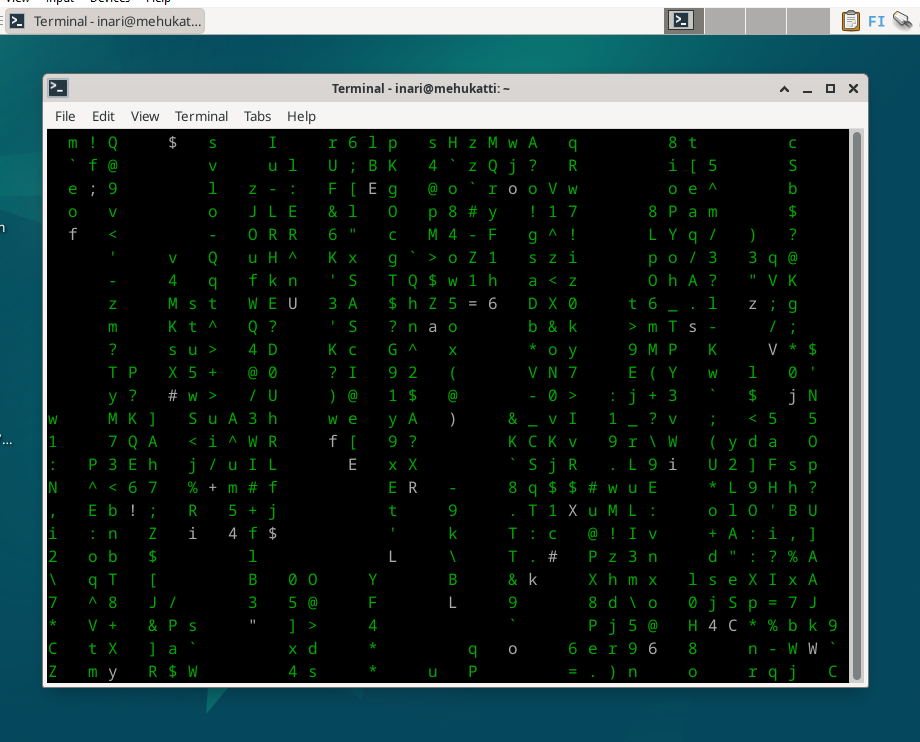

# Oma Linux

## Virtuaalikone

Aloitin ensimmäisenä lataamalla VirtualBoxin koneelleni. Tämän jälkeen kävin lataamassa uusimman Debian version. Loin Expert modessa uuden virtuaalikoneen nimellä DebianInaHar. Valitsin aiemmin lataamani ISO kuvan ja valitsin vielä Skip Unattended Installation. Tässä kohtaa se onnistui, koska aikaisemmalla yrityksellä en jostain syystä pystynyt valitsemaan sitä ollenkaan. Ihan ensimmäisellä yrityksellä en tajunnut edes vaihtaa Expert modeen, jolloin jostain syystä en pystynyt esimerkiksi muuttamaan versiota 64-bittiseksi, vaan se hyppäsi automaattisesti 32-bittiseksi. Taistelin tämän kanssa jonkun aikaa, kunnes tajusin missä meni pieleen. En tiedä miten korjasin tuon, että sain skipattua Unattended Installationin. Ei siis ollut mitään oikeaa ongelmaa, vain omaa tarkkaavaisuuden puutetta.

Jatkoin eteenpäin asettamalla muistiksi 4000 mb ja prosessorien määrän jätin yhteen, koska ohjeissa ei oltu erikseen määritelty kuinka monta niitä tulisi olla. Hard Disk kohdassa kaikki olikin valmiiksi oikein eli Create a Virtual Hard Disk Now oli jo valittu ja koko 20 gb. Tämän jälkeen käynnistin koneen ja näkyviin tuli boot menu. Valitsin ensimmäisenä olen vaihtoehdon eli live-tilan. Seuraavaksi avasin selaimen ja testasin vierailemalla Wikipediassa, että esimerkiksi netti, hiiri ja näppäimistö toimivat.

## Debian

Avasin Debian installerin ja aloitin säätämällä asetukset oikeiksi ennen asennuksen aloittamista. Kieli englanniksi, alue Suomi ja näppäimistön kieleksi suomi. Seuraavassa kohdassa valitsin, että levy tyhjennetään kokonaan. Salausta en ottanut käyttöön. Boot loaderin sijainniksi jätin siinä valmiina olleen eli MBR. Tämän jälkeen laitoin koko nimeni ja keksin käyttäjänimen. Koneen nimeksi tuli mehukatti. Asetin vielä salasanan ja sitten pääsin aloittamaan asennuksen.

Asennus onnistui ilman ongelmia ja pääsin kirjautumaan sisään. Kokeilin taas ensin, että kaikki toimii. Tämän jälkeen avasin terminaalin ja syötin "sudo apt-get update" komennon, joka päivittää kaikkiin sovelluksiin uusimman version. Tuli vielä varmistus, että päivitetäänkö kaikki johon laitoin komennon "sudo apt-get -y dist-upgrade" eli vastasin kyllä. Päivitysten jälkeen asensin vielä palomuurin komennolla "apt-get -y install ufw" ja laitoin sen vielä päälle. Käynnistin vielä uudelleen lopuksi.

## Matrix terminaalissa

En ottanut muita kuvia tehtävän aikana, niin asensin tuollaisen komennolla "sudo apt install cmatrix" ja ajoin kirjoittamalla vaan cmatrix.

