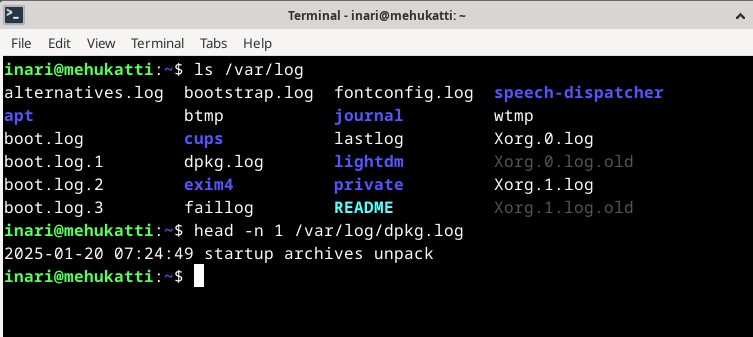

# h2 Komentaja Pingviini

## x) Lue ja tiivistä

- Käyttäjä ei kirjoita dollarimerkkiä "$"
- Olet aina jossain hakemistossa.
- Pico ja nano ovat helpoimmat tekstieditorit.
- Kannattaa käyttää tabia tiedostojen ja polkujen kirjoittamiseen, jotta ei tulisi kirjoitusvirheitä.
- Koko järjestelmään vaikuttavat komennot vaativat korkeampia oikeuksia kuten esimerkiksi ohjelmistojen asentaminen ja poistaminen.

Karvinen, Tero 2020: Command Line Basics Revisited. https://terokarvinen.com/2020/command-line-basics-revisited/?fromSearch=command%20line%20basics%20revisited // luettu 22.1.2025

## a) Micro

Asensin micro-editorin käyttäen Youtubesta löytämäni videon ohjeita. Kysyin kyllä eka tekoälyltä (ChatGPT), että löytyykö micro-editor jo valmiiksi paketinhallinnasta koska en ollut varma. Aloitin kirjoittamalla terminaaliin komennon "sudo apt install micro" jonka jälkeen annoin salasanan. Tarkistin vielä asennuksen käyttäen komentoa "micro --version." Tämän jälkeen menin ls-komennon kautta kokeilemaan editoria.

https://www.youtube.com/watch?v=TNJUgDSSv1M&ab_channel=GuideDose // katsottu 23.1.2025

## b) Apt

Asensin seuraavat kolme komentoriviohjelmaa käyttäen komentoa "sudo apt-get update && sudo apt-get install -y htop curl tree."

Htop näyttää järjestelmän prosessit.

Curlia voidaan käyttää esimerkiksi verkkosivujen sisällön hakemiseen.

Tree näyttää hakemistorakenteen puumaisessa muodossa.

## c) FHS

## d) The Friendly M

## e) Pipe

## f) Rauta
