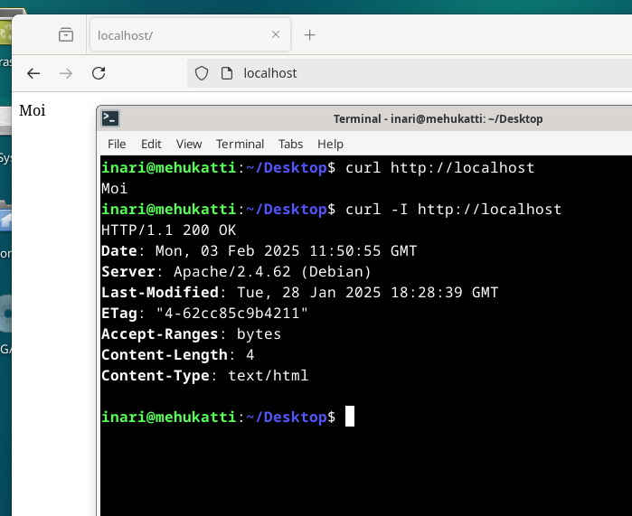
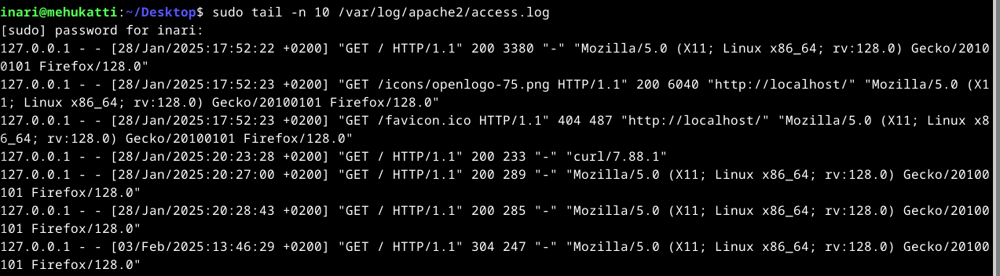

# h3 Hello Web Server

## x) Lue ja tiivistä

The Apache Software Foundation 2023: Apache HTTP Server Version 2.4 Documentation: Name-based Virtual Host Support https://httpd.apache.org/docs/2.4/vhosts/name-based.html

- fwewef

Karvinen 2018: Name Based Virtual Hosts on Apache – Multiple Websites to Single IP Address https://terokarvinen.com/2018/04/10/name-based-virtual-hosts-on-apache-multiple-websites-to-single-ip-address/

- gijasoi

## a) 

## b)

- 127.0.0.1 on localhostin IP-osoite
- [28/Jan/2025:17:52:22 +0200] on aikaleima joka kertoo milloin rivi on syntynyt eli pyyntö on silloin kirjattu lokiin
- GET on HTTP-metodi
- HTTP/1.1 tarkoittaa HTTP protokollan versiota
- 200 eli yhtäkuin OK, pyyntö onnistui
- Ylemmän kohdan jälkeinen numero eli esimerkiksi lokin ekalta riviltä tuo 3380 (tavua) kertoo sivun suuruuden

https://signoz.io/guides/apache-log/
