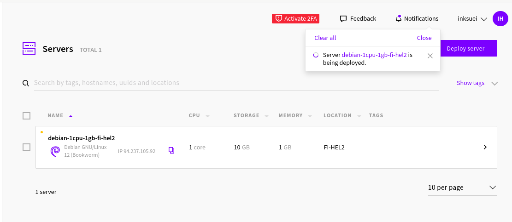
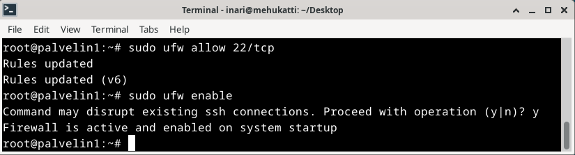
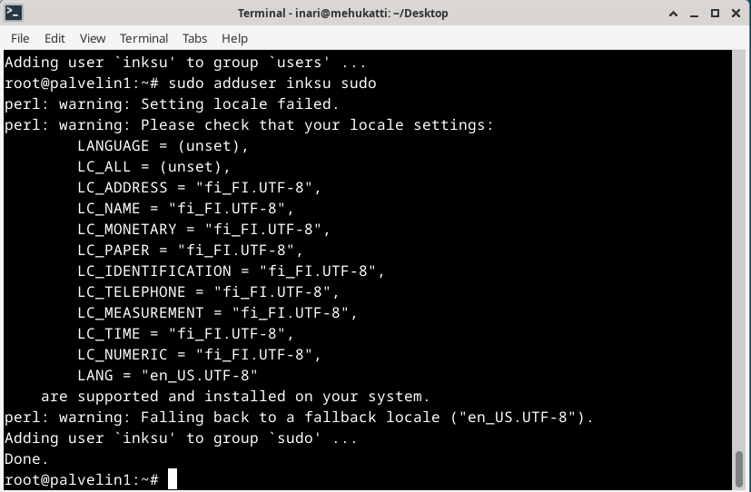
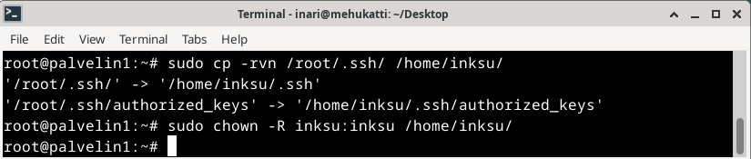
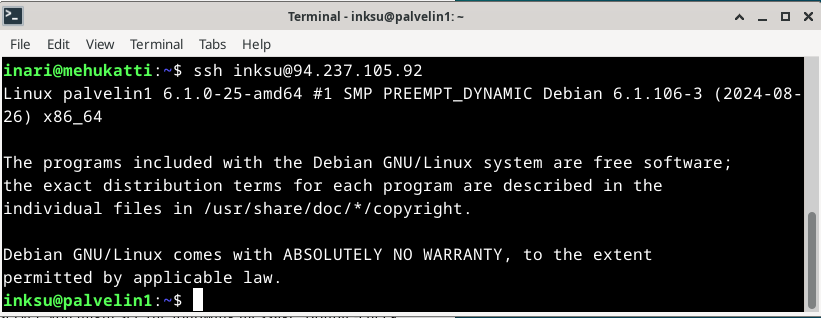
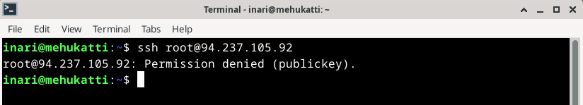
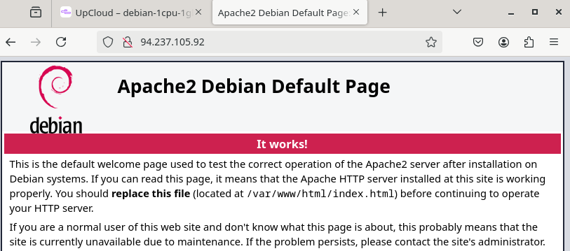
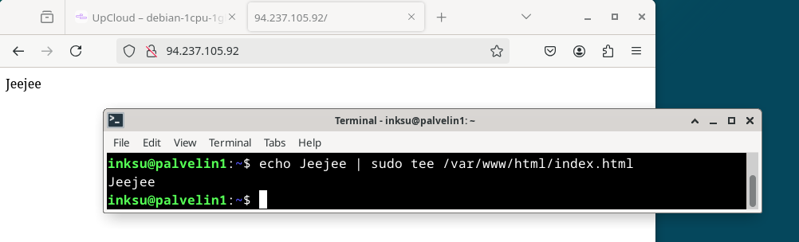

# h4 Maailma kuulee

## x) Lue ja tiivistä

Susanna Lehto 2022: Teoriasta käytäntöön pilvipalvelimen avulla (h4), https://susannalehto.fi/2022/teoriasta-kaytantoon-pilvipalvelimen-avulla-h4/

- Kannattaa ottaa edullisin peruspaketti ja laajentaa myöhemmin jos tarvetta
- Jotta datansiirto olisi nopeaa, datakeskus kannattaa valita mahdollisimman läheltä käyttäjiä
- SSH-avaimet parempia turvallisuuden kannalta
- Ennen mitään asentamista haetaan päivitykset
- Palomuuriin pitää tehdä reikä porttia varten
- Ennen toimivan kotisivun tekemistä tehdään pääkäyttäjä virtuaalipalvelimelle

Karvinen 2012: First Steps on a New Virtual Private Server – an Example on DigitalOcean and Ubuntu 16.04 LTS, https://terokarvinen.com/2017/first-steps-on-a-new-virtual-private-server-an-example-on-digitalocean/

- Rootia käytetään vain ensimmäisellä kirjautumiskerralla
- Kirjautumisen jälkeen ensimmäiseksi palomuurin asentaminen ja sen päälle laittaminen
- Sudolla uusi käyttäjä ja sudo oikeudet käyttäjälle
- Root kirjautuminen pitää poistaa käytöstä

## a) Palvelimen vuokraus

Valitsin palveluntarjoajaksi UpCloud:n, koska sitä käytettiin edellisellä tunnilla esimerkkinä, mikä helpottaa tehtävän tekemistä. Olin tehnyt jo edellisen tunnin aikana käyttäjän sivustolle valmiiksi, joten aloitin suoraan palvelimen käyttöönoton. Valitsin sijainniksi Suomen (FI-HEL2) ja otin halvimman paketin. En ottanut mitään ylimääräisiä juttuja lisäksi, vaan menin suoraan käyttöjärjestelmän valintaan ja valitsin Debianin. Verkkovalinnat jätin sellaiseksi kuin ne olivat. Kävin luomassa SSH avaimen tehtävänannon vinkkejä noudattaen ja lisäsin luomani avaimen kirjautumistavaksi. Muutin vielä hostnamen sekä tarkistin vielä valinnat, jonka jälkeen painoin deploy. Tämän jälkeen katsoin vielä "How to connect" ohjeet ja kirjauduin niiden mukaisesti eli root ja palvelimen IP-osoite. 

## b) Alkutoimien tekeminen

Aloitin tekemällä reijän palomuuriin komennolla $ sudo ufw allow 22/tcp ja laitoin palomuurin vielä päälle komennolla $ sudo ufw enable. Komennon $ sudo ufw allow 80/tcp laitoin myöhemmin, koska seurasin kolmea eri ohjetta tätä tehdessä.

Palomuurin jälkeen loin itselleni käyttäjän ja annoin käyttäjälle sudo-oikeudet komennoilla 
-   $ sudo adduser inksu
-   $ sudo adduser inksu sudo

Seuraavaksi yritin kirjautua uudella käyttäjällä, mutta olin vahingossa mennyt ohjeissa ohi kohdan, jossa kopioidaan rootin ssh-asetukset. En siis päässyt tietenkään kirjautumaan, joten suoritin vaiheen ja kokeilin uudelleen.

Sitten suljin root-tunnuksen komennoilla

- $ sudo usermod --lock root
- $ sudo mv -nv /root/.ssh /root/DISABLED-ssh/

Testasin vielä, että se varmasti toimi ja yritin kirjautua sisään rootia käyttäen.

## c) Weppipalvelimen asennus

Asensin vielä Apache-weppipalvelimen käyttäen komentoa

- $ sudo apt-get install apache2

Tein vielä toisen reijän palomuuriin komennolla

- $ sudo ufw allow 80/tcp

Tämän jälkeen kävin testaamassa, että Apachen testisivu tulee näkyviin.

Korvasin vielä testisivun komennolla

- $ echo Jeejee | sudo tee /var/www/html/index.html

Testasin puhelimella, että sivu näkyy julkisesti ja näkyihän se.

## Lähteet

- h4 ohjeet ja vinkit https://terokarvinen.com/linux-palvelimet/#h4-maailma-kuulee
- https://susannalehto.fi/2022/teoriasta-kaytantoon-pilvipalvelimen-avulla-h4/
- https://terokarvinen.com/2017/first-steps-on-a-new-virtual-private-server-an-example-on-digitalocean/

