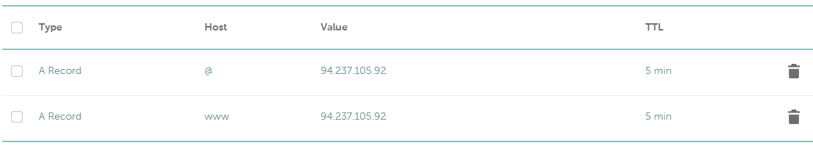
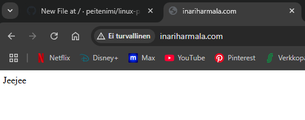
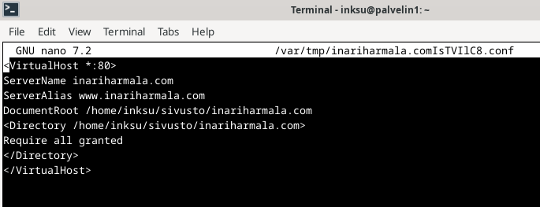
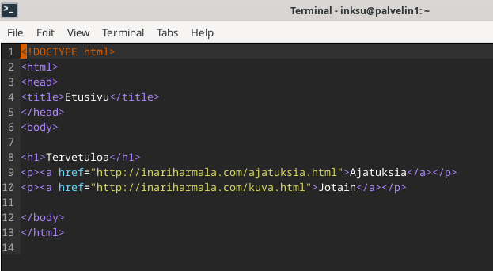
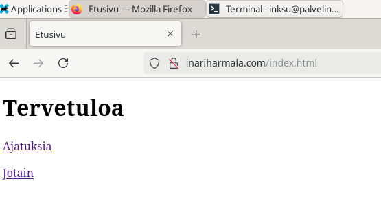
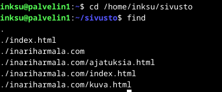
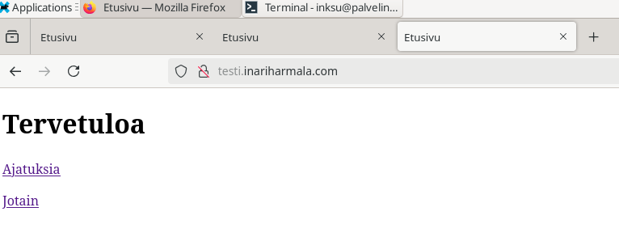
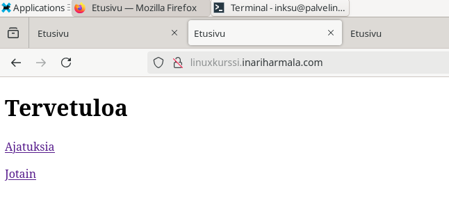

# h5 Nimekäs

## a) Nimi

Päätin valita Namecheapin nimen vuokraamiseen, koska en tiedä muita nimiä tarjoavia palveluita ja opettaja suositteli sitä. Helppokäyttöinen sivusto, mutta sähköpostin vahvistamisen kanssa oli ongelma, jonka vuoksi jouduin ottamaan asiakaspalveluun yhteyttä. Sain hoidettua asian 10 minuutissa ja pääsin jatkamaan tehtävää.

Käytin tehtävässä edellisessä kotiläksyssä ollutta opiskelijan esimerkkiraporttia apuna. Hän oli myös käyttänyt Namecheapia, mikä teki tehtävän tekemisestä helppoa. Domainnimeksi tuli inariharmala.com. Kun olin luonut sen, piti vielä laittaa nimi osoittamaan palvelimelle, jonka olin edellisessä tehtävässä hankkinut. Klikkasin sivustolla vasemmalla puolella olevasta listasta "Domain List" ja sieltä edelleen "Advanced DNS" jonka jälkeen painoin vielä punaisella olevaa "Add new record" nappia. Sieltä lisäsin kaksi uutta A Recordia.

Testasin vielä sivuston toimivuutta. Hakemalla domainnimellä, tuli näkyviin sama teksti, joka näkyy myös, kun hakee palvelimen IP-osoitteella.

## b) Based

Lähdin tekemään aikaisemman kotiläksyn (h3 Hello Web Server) ohjeiden mukaan (Karvinen 2018: Name Based Virtual Hosts on Apache – Multiple Websites to Single IP Address) tätä kohtaa. Aloitin avaamalla configuraatio asetukset komennolla 'sudoedit /etc/apache2/sites-available/inariharmala.com.conf'. Alempana olevassa kuvassa näkyy asetukset, jotka kirjoitin. Tämän jälkeen laitoin komennolla 'sudo 2ensite inariharmala.com' sivuston päälle. Käynnistin vielä apachen uudelleen. Seuraavaksi loin vielä sivun normaalina käyttäjänä käyttäen komentoa 'mkdir -p /home/inksu/sivusto/inariharmala.com/' ja echosin vielä jotakin tekstiä sivustolle.

Sivusto ei kuitenkaan "toiminut", vaan sain 403 Forbidden ilmoituksen, kun päivitin sivuston. Löysin kuitenkin aikaisemman kotiläksyn ohjeista komennon 'chmod ugo+x $HOME $HOME/public_html/', 'ls -ld $HOME $HOME/public_html/', jonka avulla sain sivun toimimaan. 

## c) Kotisivu

Asensin ensimmäisenä micron, koska olin aikaisemmin unohtanut asentaa sen. Sen jälkeen loin index.html lisäksi kaksi muuta sivua, joista tulivat ajatuksia.html ja kuva.html. Käytin komentoa 'micro /home/inksu/sivusto/inariharmala.com/ESIMERKKI.html' kun loin uuden sivun. Olin siis eka ajatellut, että laittaisin viimeiseen jonkun kuvan, mutta en keksinyt minkä, niin jätin sivun sitten tyhjäksi. Käytin W3Schools sivustoa apuna.

## d) Alidomain

Aloitin tehtävän menemällä Namecheapin sivuille, sieltä omat sivut ja vasemman reunan listasta valitsin kohdan "Domain List." Sieltä menin taas oman domainin hallintasivulle napista "Manage" ja sieltä edelleen painoin "Advanced DNS" josta pääsin lisäämään uudet A-tietueet. Host kohtaan laitoin "linuxkurssi" ja toiseen "testi" sekä arvoksi tietenkin palvelimeni IP-osoitteen. Kävin testaamassa tätä palvelimellani laittamalla terminaaliin 'ping linuxkurssi.inariharmala.com' ja se vastasi palvelimeni IP-osoitteella. Kävin vielä lisäämässä alidomainit Virtual Host konfiguraatio asetuksiin ServerAlias kohtaan. Tämän jälkeen käynnistin vielä Apachen uudelleen ja testasin toimivatko alidomainit. Alempana kuvat.

## Lähteet

- https://susannalehto.fi/2022/teoriasta-kaytantoon-pilvipalvelimen-avulla-h4/
- https://terokarvinen.com/2018/name-based-virtual-hosts-on-apache-multiple-websites-to-single-ip-address/?fromSearch=name%20based%20virtual%20host
- https://www.w3schools.com/html/default.asp
