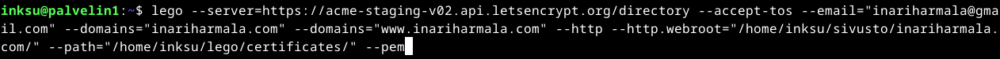
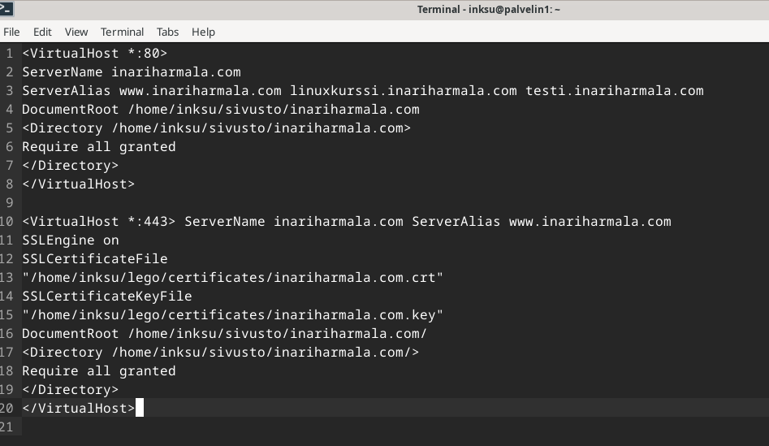
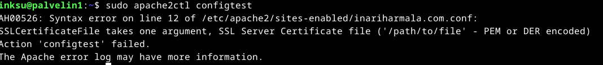
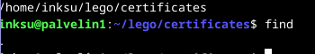

# h6 Salataampa

## x) Lue ja tiivistä

Let's Encrypt 2024: How It Works
- Let's Encryptin ja ACME protokollan tavoittena on mahdollistaa HTTPS-palvelimen käyttöönotto ja saada se automaattisesti hankkimaan selainten luottama varmenne ilman ihmisen väliintuloa
- Julkista avainta käytetään palvelimen ylläpitäjän tunnistamisessa
- Agenttiohjelmisto luo ensimmäisellä kerralla uuden avainparin todistaakseen, että palvelin hallitsee yhtä tai useampaa verkkotunnusta
- Todennus tapahtuu CA antamalla haasteella, joka voi olla DNS-tietueen luominen verkkotunnuksen alle tai HTTP-resurssin luominen määrättyyn sijaintiin
- CA tarkistaa haasteiden onnistumisen ja varmistaa nonce-allekirjoituksen, jonka agentti on allekirjoittanut yksityisellä avaimellaan

Lange 2024: Lego: Obtain a Certificate: Using an existing, running web server
- --http-vaihtoehto vaatii myös --http.webroot-asetuksen jos palvelin käyttää jo porttia 80
- Jotta vahvistus voi onnistua, hakemiston täytyy olla julkisesti saatavilla verkkotunnuksen juurena /

## a) Let's

Aloitin tehtävän käynnistämällä Apachen uudelleen ja tarkistamalla, että sivustoni toimii. Hain päivitykset ja sitten asensin legon. Kokeilin ensin testipalvelimella hakea sertifikaatin. Olin hieman hölmö, koska en tajunnut tarkistaa, että onhan certificates kansiossa jotakin. Katsoin vain, että kansio ilmestyi sinne ja totesin, että toimii ja voin jatkaa oikean sertifikaatin hankkimiseen. Siinä taisin kuitenkin tehdä virheen, sillä olisi pitänyt varmaan katsoa, tuliko kansioon se mitä pitikin.

Poistin pathin joka sisälsi testitietoa ja ajoin sertifikaatti komennon uudelleen ilman '--server=https://acme-staging-v02.api.letsencrypt.org/directory' -kohtaa. Laitoin siis kaikki muuten täysin samoin ja luulin taas onnistuneeni. Jatkoin kuitenkin kohtaan, jossa piti ottaa sertifikaatti käyttöön name based virtual host -asetuksissa. 

Unohdin, että eka olisi ehkä pitänyt käynnistää apache uudelleen, niin menin suoraan komentoon 'sudo a2enmod ssl' jonka jälkeen laitoin 'sudo apache2ctl configtest" josta tuli tällainen ilmoitus. Kävin tarkistamassa konfiguraatioasetukset, mutta siellä ei ollut mitään kirjoitusvirheitä. Tajusin hetken tonkimisen jälkeen, että certificates kansioon ei ollut tullut mitään. Kokeilin poistaa koko lego kansion ja tehdä sertifikaatin hakemisen uudelleen, mutta se ei toiminut. Toistin saman siis pari kertaa ja luovutin.

## b) A-rating
