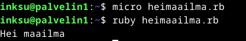

# h7 Maalisuora

## a) Kirjoita ja aja "Hei maailma" kolmella eri kielellä

Ennen kuin lähdin tekemään tehtävää, hain päivitykset ja sitten asensin ohjelmointikielien paketit komennolla 'sudo apt-get install python3 gcc g++ openjdk-17-jdk golang-go ruby lua5.4' 

## Python

Editoriin 'print("Hei maailma")'

## Ruby

Editoriin 'print ("Hei maailma\n")'

## C

## c) Laita Linuxiin uusi, itse tekemäsi komento niin, että kaikki käyttäjät voivat ajaa sitä

## Lähteet

- h7 ohjeet ja vinkit https://terokarvinen.com/linux-palvelimet/#h7-maalisuora
- Karvinen 2007: Shell Scripting https://terokarvinen.com/2007/12/04/shell-scripting-4/
- Karvinen 2018: Hello World Python3, Bash, C, C++, Go, Lua, Ruby, Java – Programming Languages on Ubuntu 18.04 https://terokarvinen.com/2018/hello-python3-bash-c-c-go-lua-ruby-java-programming-languages-on-ubuntu-18-04/
